# Quality Gate Analyzer

Monorepo for the Quality Gate Analyzer project: a Spring Boot backend that detects quality gate
tools (linters, coverage, code-quality scanners) in GitHub repositories, checks how strictly
they're enforced, and measures their impact on code quality over time — plus a React frontend
for exploring the results.

## Screenshots

All 20 images under [`screenshots/`](screenshots/) are rendered below.

### Application

| Dashboard | Analyze |
|---|---|
| [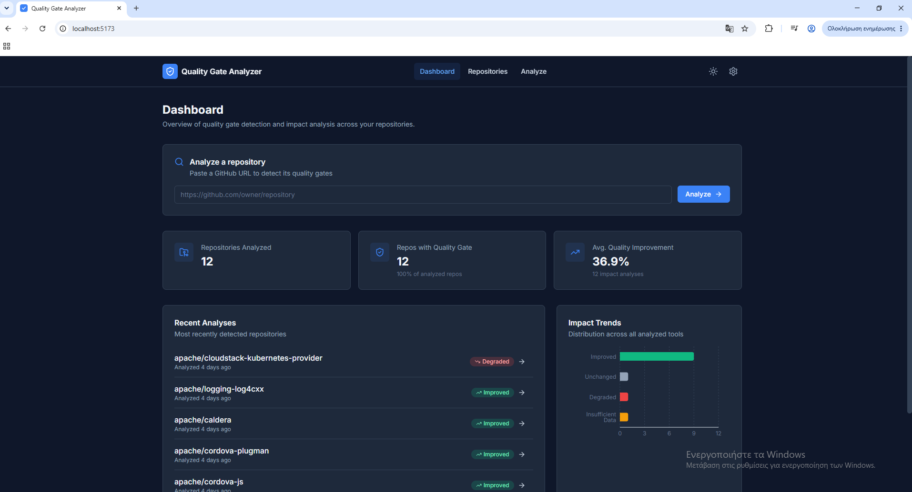](screenshots/dashboard_page.png) | [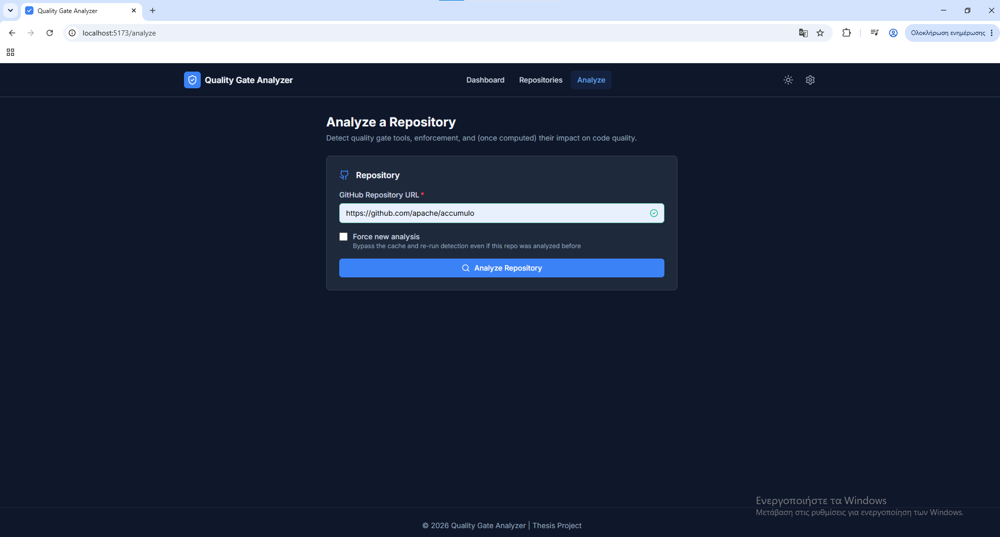](screenshots/analyze_page.png) |

| Repositories | Settings |
|---|---|
| [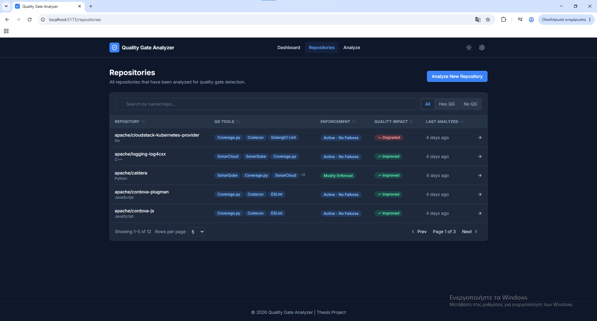](screenshots/repositories_page.png) | [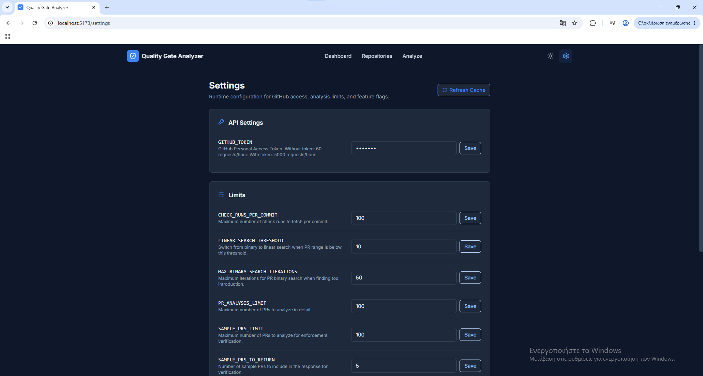](screenshots/settings_page.png) |

- **[Dashboard](screenshots/dashboard_page.png)** — fleet-wide stats (repos analyzed, repos with a quality
  gate, average quality improvement) plus recent analyses and the impact-trend breakdown.
- **[Analyze](screenshots/analyze_page.png)** — kick off detection for a new repository by GitHub URL,
  with a "Force new analysis" option to bypass the cache.
- **[Repositories](screenshots/repositories_page.png)** — sortable/searchable table of every analyzed
  repo: detected QG tools, enforcement status, quality impact, and last-analyzed time.
- **[Settings](screenshots/settings_page.png)** — runtime configuration for the GitHub token, API/analysis
  limits, and feature flags, with a cache-refresh action.

### Repository detail — example scenarios (`screenshots/experiments/`)

Three real repositories walked through all four Repository Detail tabs (Overview, Quality Gates,
Enforcement, Quality Impact), chosen to represent the three outcomes the impact-analysis pipeline
can report.

#### Improved

Quality got measurably better after the quality gate was introduced (`apache/caldera`, Mostly
Enforced at 85%, +24.2% improvement score).

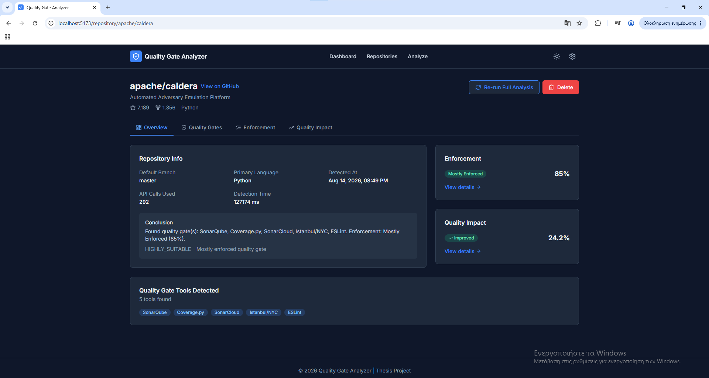
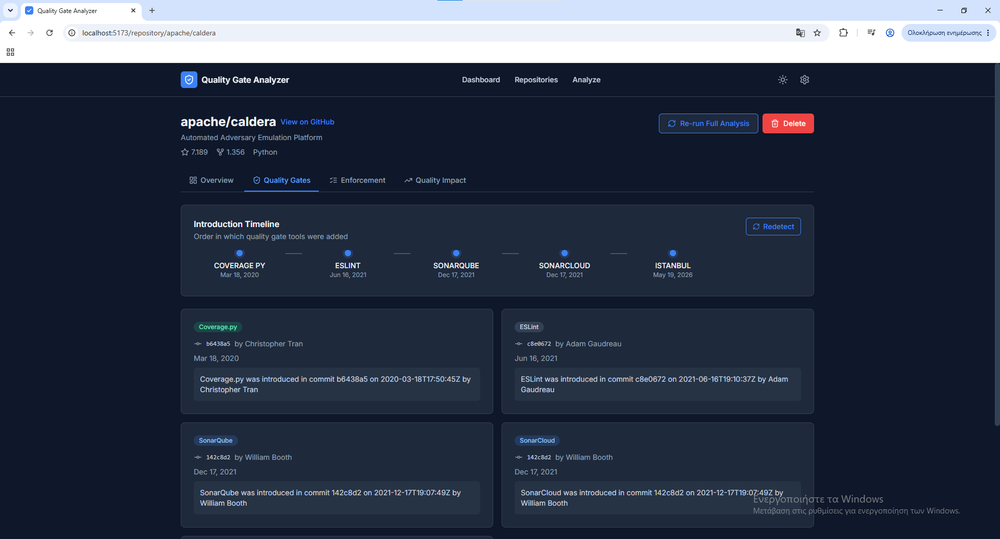
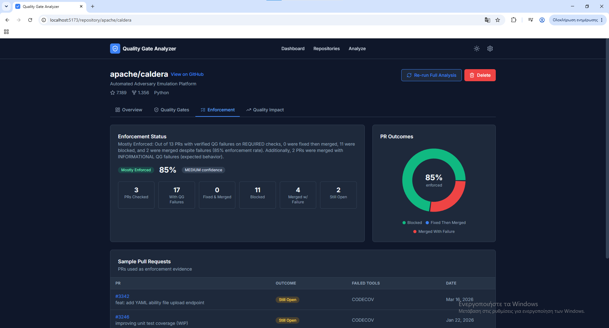
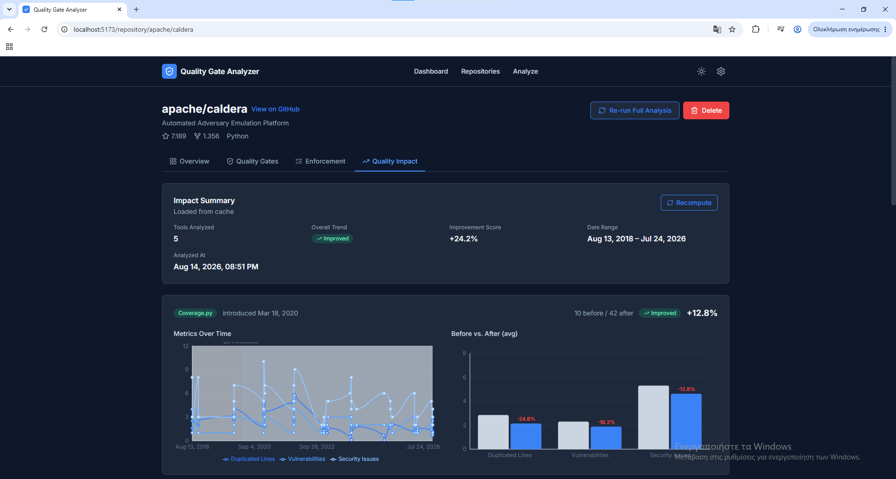

#### Degraded

Quality got measurably worse after the quality gate was introduced.

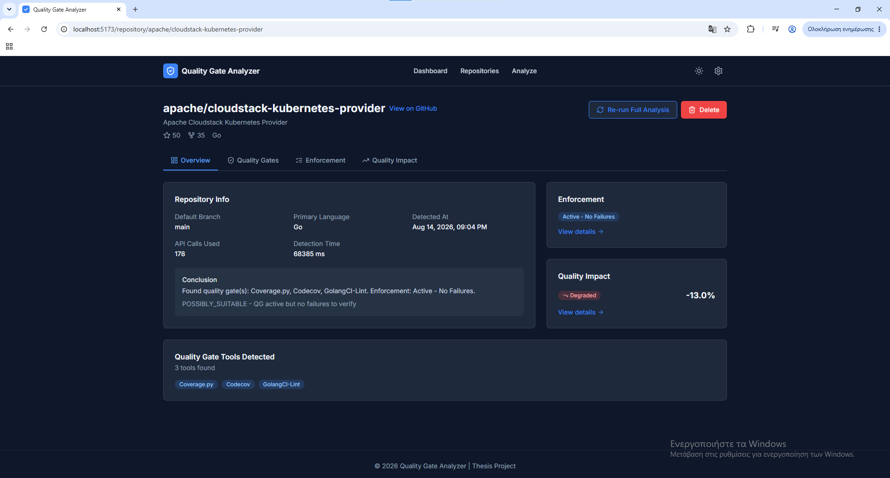
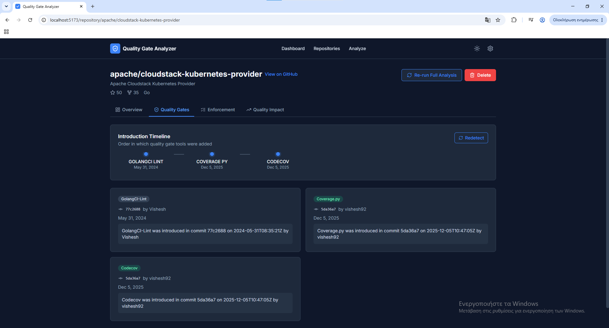
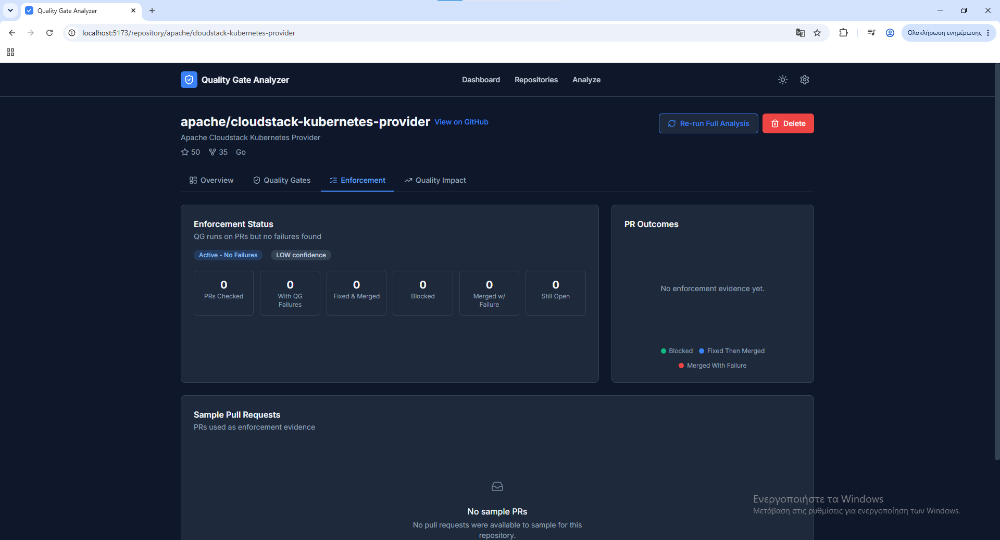
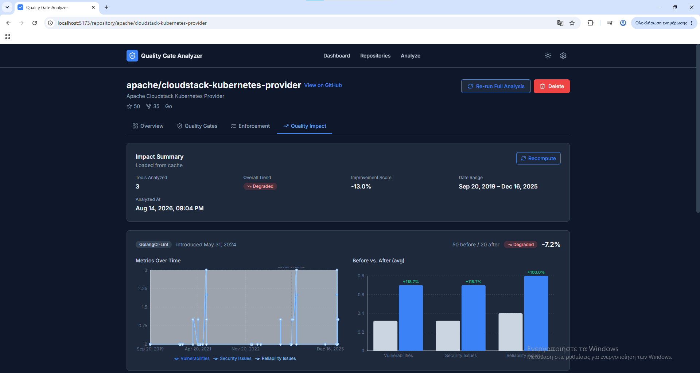

#### Unchanged

No significant before/after difference.

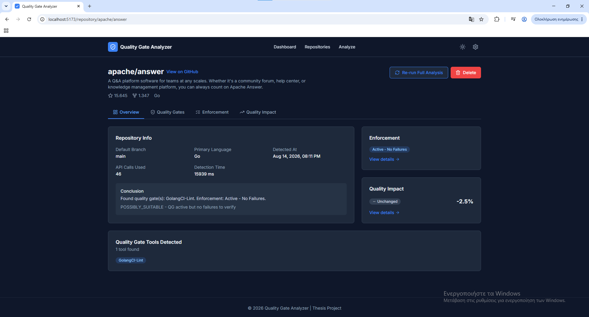
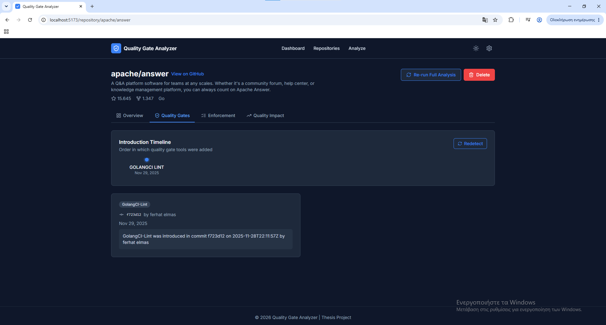
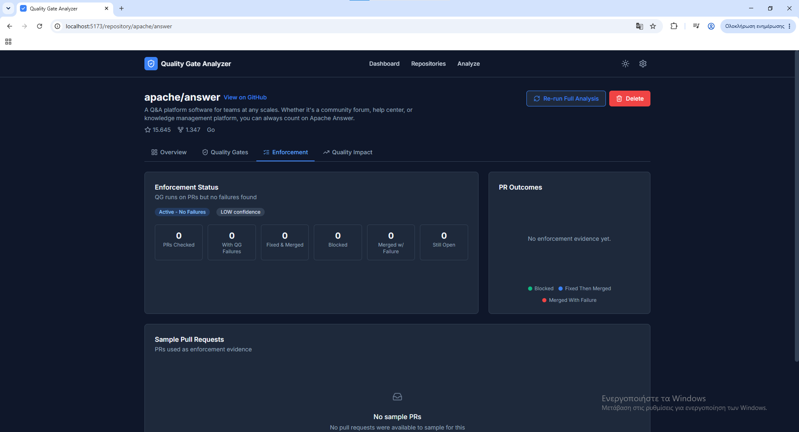
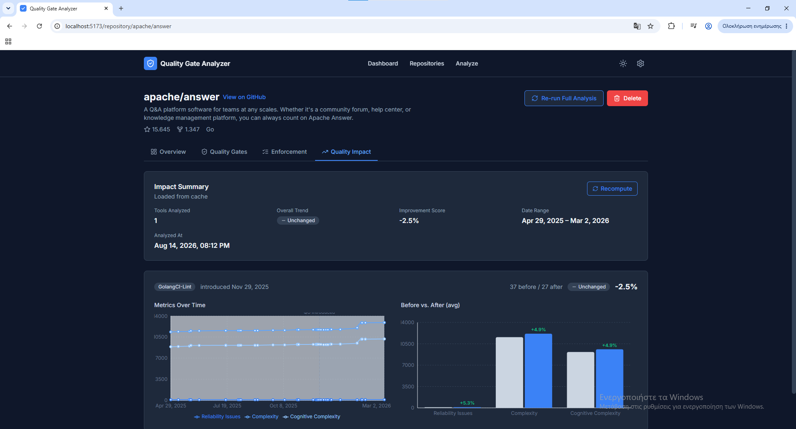

### SonarQube analysis cadence (`screenshots/sonarqube_analysis_cadence/`)

Output of the [`scripts/`](scripts/README.md) cadence tooling — per-repository timelines of when
SonarQube analyses land across a repo's PR history.

**all_data.png** — every SonarQube analysis, unfiltered (2310 repos, 139,107 analyses).

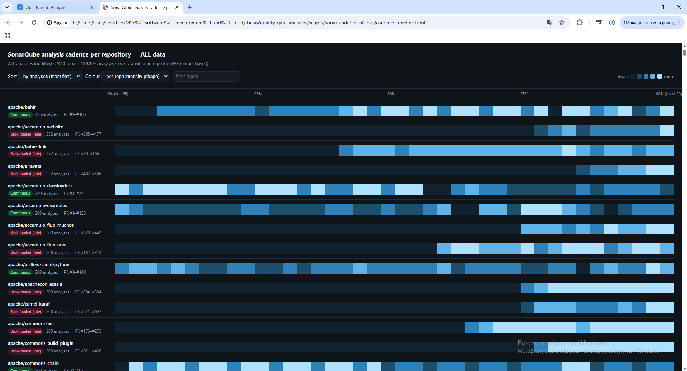

**ok_only.png** — restricted to analyses where `qualityGateStatus == OK` (483 repos, 45,022
analyses).

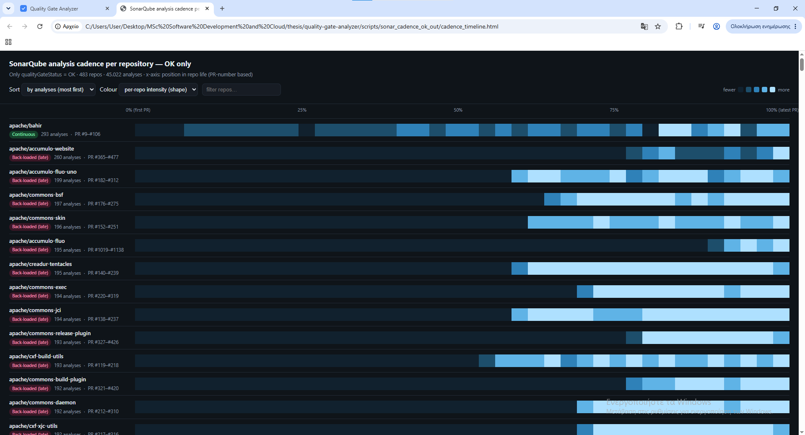

## Layout

```
.
├── backend/              Spring Boot API (see backend/README.md)
├── frontend/             React + TypeScript UI (see frontend/README.md)
├── scripts/              Standalone Python tooling for Sonar/PR cadence analysis
└── docker-compose.yml    Shared infrastructure (Postgres, pgAdmin) — not the app itself
```

`docker-compose.yml` only runs infrastructure. The backend and frontend both run as regular
local processes (`mvn spring-boot:run` / `npm run dev`), not as containers.

## Getting started

Three things, in order — database, backend, frontend:

```bash
# 1. Database (Postgres on :5433, + optional pgAdmin on :5050)
docker-compose up -d
# or: docker-compose --profile admin up -d

# 2. Backend (:8080 — runs Flyway migrations automatically)
cd backend
mvn spring-boot:run

# 3. Frontend (:5173)
cd frontend
npm install
npm run dev
```

Then open `http://localhost:5173`. See [backend/README.md](backend/README.md) and
[frontend/README.md](frontend/README.md) for feature details, API reference, and project structure.

## How to test

- **Backend**: `cd backend && mvn test` — full unit/integration test suite.
- **Frontend**: `cd frontend && npm run build && npm run lint` — type-check + lint (no
  automated test suite yet).
- **End-to-end**: with all three services running, use the UI at `localhost:5173` — paste a
  GitHub URL on the Dashboard or Analyze page, walk through the Repository Detail tabs
  (Overview / Quality Gates / Enforcement / Quality Impact), run an impact analysis from the
  Quality Impact tab, and try the cache-bypassing actions (header's Re-run Full Analysis --
  only visible once that impact analysis exists -- Quality Gates tab's Redetect, Quality Impact
  tab's Recompute, and Delete) to confirm the confirmation dialogs and toasts fire correctly.

## Shutting down without losing data

```bash
# Frontend / backend: Ctrl+C in their respective terminals — both are stateless.

# Database: stop or remove containers, but keep the named volume (postgres_data)
docker-compose stop      # keeps containers too, for a fast restart via `docker-compose start`
# or
docker-compose down      # removes containers, keeps volumes — `docker-compose up -d` recreates them

# Never run `docker-compose down -v` unless you actually want to wipe the database —
# the -v flag deletes the named volumes along with the containers.
```

## Scripts

Standalone Python utilities, unrelated to the backend's runtime — see [scripts/README.md](scripts/README.md).
